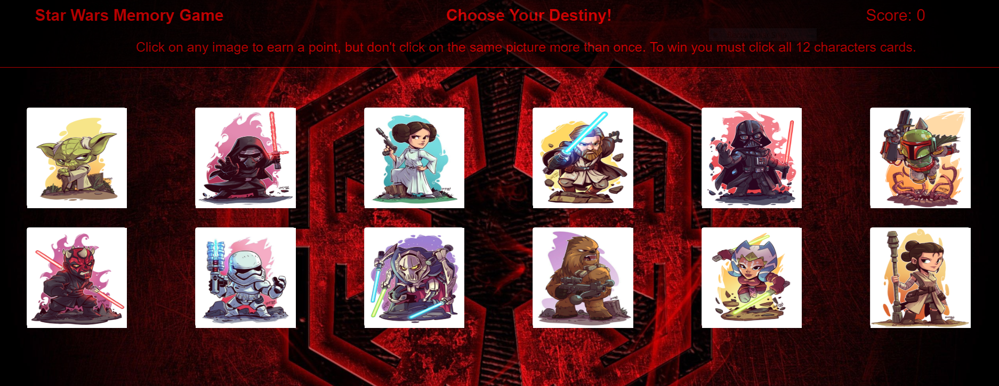

# Star Wars Memory Game

<strong><h2>How To Play</h2></strong>
1. Click on one character card.
2. If you click the same card more than once you lose.
3. Continue clicking on different cards until you have clicked all 12 or lose.
4. The app will keep track of the player score with each correct guess equaling 1 pt.
  

 
<strong><h2>Technologies Used:</h2></strong>
<ul>
<li>JavaScript</li>
<li>BootStrap</li>
<li>CSS</li>
<li>React</li>
<li>ES6</li>
<strong><h2>Author:</h2></strong>
CJ Summers
